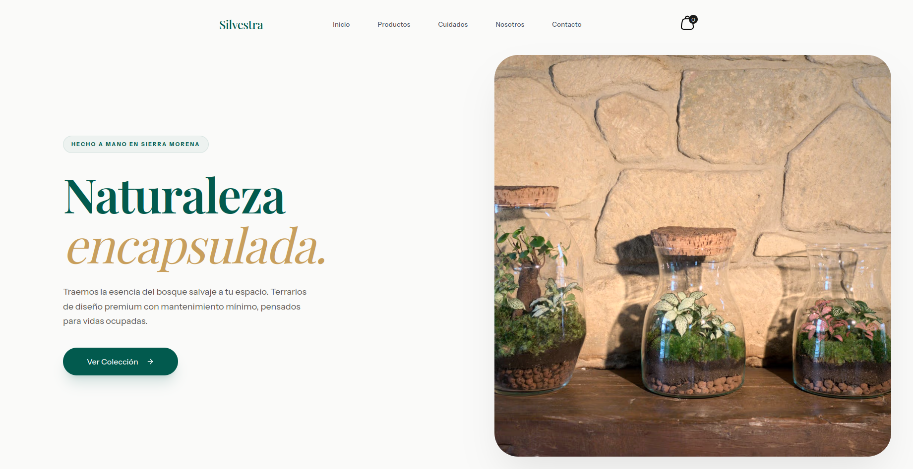

# Silvestra | Headless E-commerce Ecosystem

**"Off-the-shelf templates compromise a brand's soul. I engineered a bespoke headless solution to ensure the digital experience feels as premium as the product itself."**

  

### 🏗️ Architecture: Type-Safe Data Pipeline

In e-commerce, data integrity is conversion. I built a rigid workflow for absolute reliability:

- **Next.js 15 & Shopify API**: Fully decoupled architecture for total control and Edge-ready scale.
- **GraphQL Codegen**: Real-time schema scanning that auto-generates TypeScript definitions.
- **Build-Time Validation**: If the API changes, the build fails, ensuring zero runtime errors in production.
- **Server Components (RSC)**: Interactive islands hydrated from the Edge for instant response times.

### 🎨 Design Engineering: Systems & Physics

I treat UI as critical infrastructure to eliminate the gap between design and code:

- **Tailwind v4 as an API**: Figma tokens mapped directly to semantic CSS variables, creating a single source of truth.
- **Organic Physics**: Used **Framer Motion** for tactile, "expensive" interactions at a constant 60fps.
- **Headless UI**: Built on **Radix UI** to ensure interactions are pure, accessible, and decoupled from business logic.

### 🚀 Production Standards

- **Lighthouse 99**: Obsessive optimization because speed is direct revenue in e-commerce.
- **WCAG 2.1 Compliance**: Accessibility as a primitive; keyboard navigation and ARIA management integrated by default.
- **AI Orchestration**: Leveraging **Cursor** and **Claude Code** to eliminate boilerplate while maintaining 100% architectural control.

---

### Tech Stack

`Next.js 15` · `TypeScript` · `Shopify API` · `Tailwind v4` · `Framer Motion` · `GraphQL Codegen` · `Radix UI`

[**View Live Site**](https://silvestra.es)
